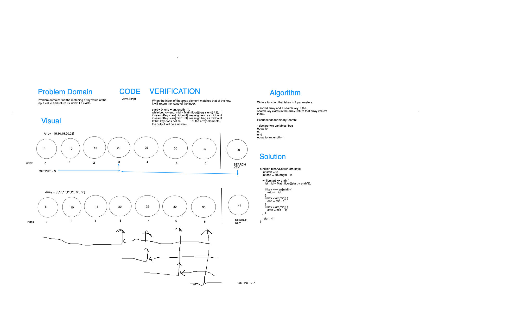

# Array Binary Search

Pull Request [array-binary-search](https://github.com/dcalhoun286/data-structures-and-algorithms/pull/29)
<!-- Short summary or background information -->

## Challenge

Write a function called `binarySearch()` which takes in two parameters: a sorted array, and the search key. Without utilizing any of the built-in methods available to your language, return the index of the array's element that matches the search key, or -1 if the element does not exist. The search algorithm used in your function should be a binary search.

## Approach & Efficiency
<!-- What approach did you take? Why? What is the Big O space/time for this approach? -->

**Approach**:

- Identify the index values of the beginning and end of the sorted array
- Identify the midpoint between the range above
- return the array element's index if the midpoint value matches the search key
- if midpoint doesn't match, decide which half of the range to continue looking for the search key
- Repeat while start <= end. If the search key cannot be found in the array, return `-1`

Our team took this approach because it requires less time than iterating through the entire array (such as a `for` loop). This becomes especially important when dealing with very large arrays.

## Solution

<!-- Embedded whiteboard image -->

[Solution code for array-reverse](array-binary-search.js)

## Collaborators and Resources

- I pair programmed with Cody Carpenter and Ryan Tipper for this code challenge assignment.
- **Resource**: [Binary search algorithm - Wikipedia](https://en.wikipedia.org/wiki/Binary_search_algorithm)
