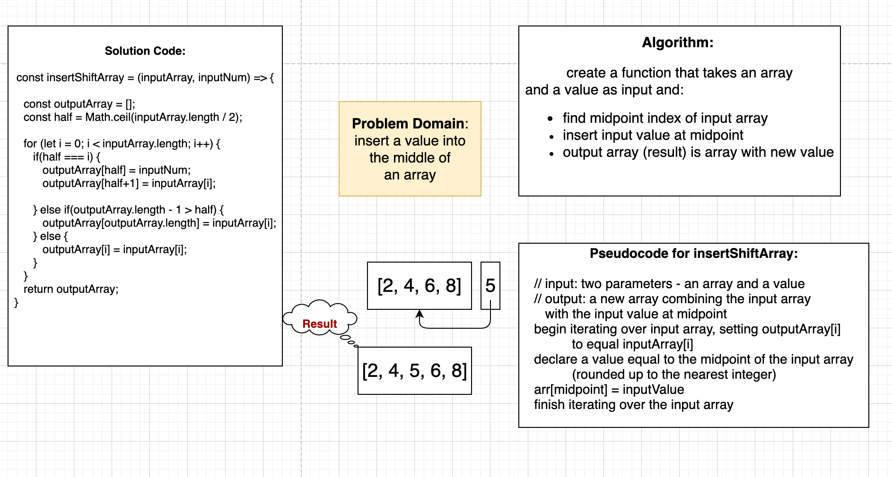

# Array Shift

Pull Request [array-shift](https://github.com/dcalhoun286/data-structures-and-algorithms/pull/27)
<!-- Short summary or background information -->

## Challenge

Write a function called `insertShiftArray()` which takes in an array and the value to be added. Without utilizing any of the built-in methods available to your language, returnan array with the new value added at the middle index.

## Approach & Efficiency
<!-- What approach did you take? Why? What is the Big O space/time for this approach? -->

## Solution
<!-- Embedded whiteboard image -->

-[Solution code for array-shift](array-shift.js)

## Collaborators

- I pair programmed with Nassir Abegaz for this code challenge assignment.
