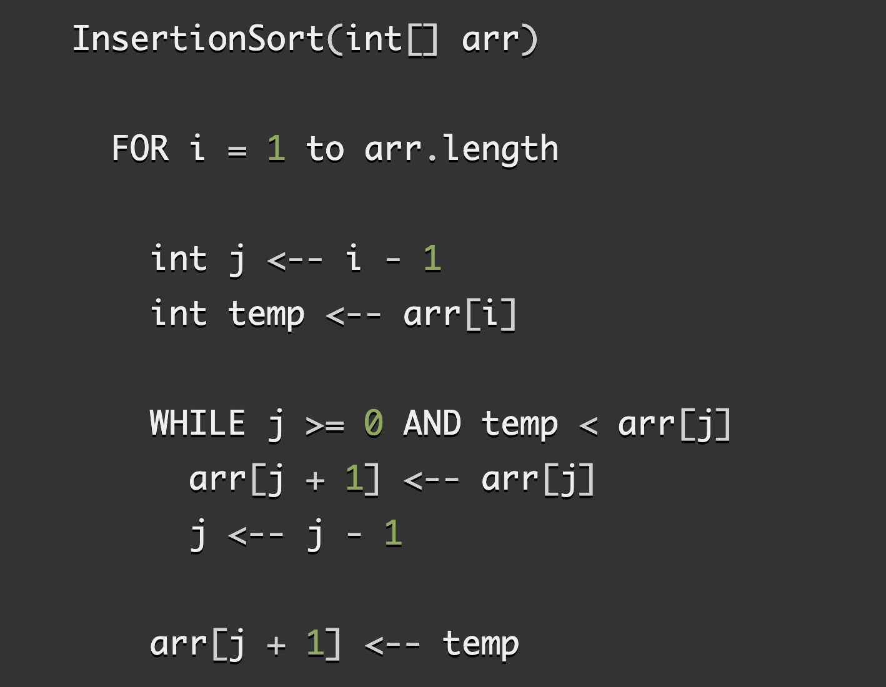

# Code Challenge: Insertion Sort

<!-- PULL REQUEST AND BLOG LINKS HERE  -->

## Challenge

Review the pseudocode below, then trace the algorithm by stepping through the process with the provided sample array. Document your explanation by creating a blog article that shows the step-by-step output after each iteration through some sort of visual.

Ensure that that your solution code is working with unit tests.

## Approach & Efficiency

Follow the link to the [blog](assets/BLOG.md) to see a more in-depth explanation of the approach taken for this code challenge.

## Solution

- [Solution code for insertion-sort](lib/insertion-sort.js)
s