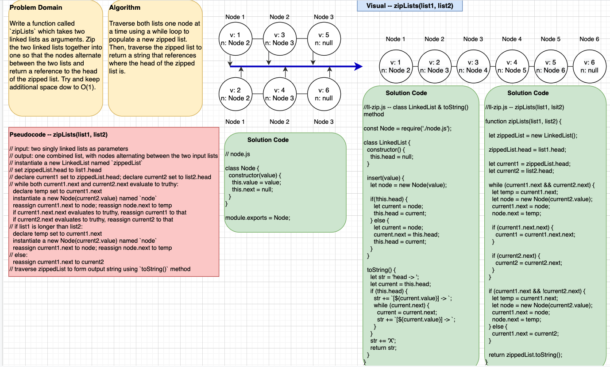

# llZip

A code challenge that zips two linked lists.

## Author: Dar-Ci Calhoun

## Links

- Pull Request [ll-zip](https://github.com/dcalhoun286/data-structures-and-algorithms/pull/34)

<!-- Short summary or background information -->

## Challenge

Write a function called `zipLists` which takes two linked lists as arguments. Zip the two linked lists together into one so that the nodes alternate between the two lists and return a reference to the head of the zipped list. Try and keep additional space down to O(1). You have access to the Node class and all the properties on the Linked List class as well as the methods created in previous challenges.

## Approach & Efficiency
<!-- What approach did you take? Why? What is the Big O space/time for this approach? -->

## Solution
<!-- Embedded whiteboard image -->

-[Solution code for ll-zip](lib/ll-zip.js)

## Collaborators
