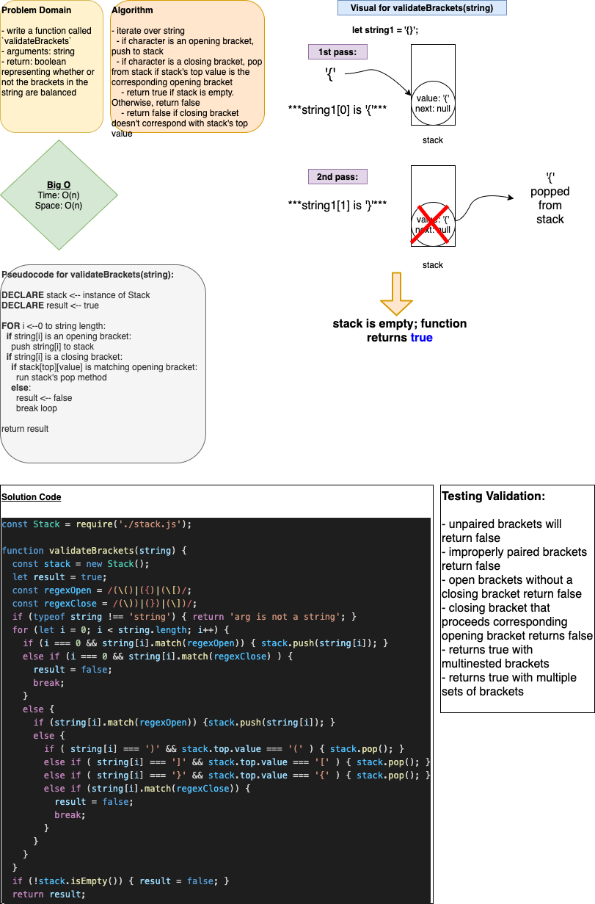

# Multi Bracket Validation

## Links

- Pull Request [multi-bracket-validation](https://github.com/dcalhoun286/data-structures-and-algorithms/pull/39)

## Challenge Description

Write a function that takes in a string comprised of opening and closing hard, soft and curly brackets. Our function should evaluate the string and return true if the brackets are balanced and false if the brackets are imbalanced.

Imbalanced brackets can be a closing without an opening, an opening without a closing, or closing and opening brackets that do not match.

Use a Stack or Queue to process your string.

## Approach & Efficiency

My function `validateString(string)` has an input string passed as an argument. Within the function, I instantiated a Stack. I iterate over the string: if the character is an opening bracket, it is pushed into the stack. If it is a closing bracket, `Stack.top` must be the current character's corresponding opening bracket for the string to be considered balanced. After iterating over the string, the stack must also be empty (meaning all opening brackets have a corresponding closing bracket).

Time complexity is `O(n)` - the function at most would iterate over the entire input string.
Space complexity is `O(n)` - the function is requiring more space for the stack as values referenced from the input string are pushed into it.

## Solution

