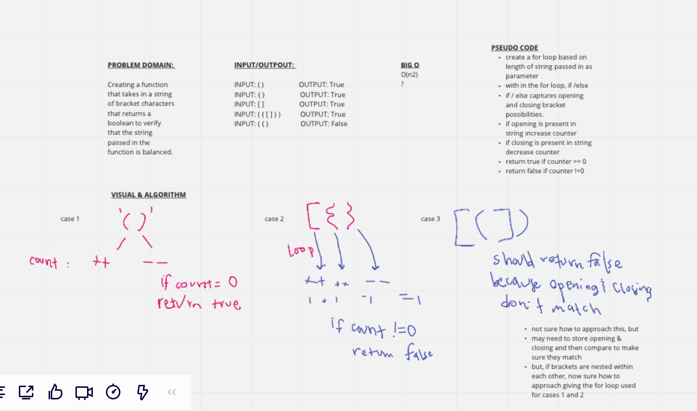

# Multi Bracket Validation

## Links

- Pull Request [multi-bracket-validation](https://github.com/dcalhoun286/data-structures-and-algorithms/pull/39)

## Challenge Description

Write a function that takes in a string comprised of opening and closing hard, soft and curly brackets. Our function should evaluate the string and return true if the brackets are balanced and false if the brackets are imbalanced.

Imbalanced brackets can be a closing without an opening, an opening without a closing, or closing and opening brackets that do not match.

## Approach & Efficiency

While perhaps not the most efficient, a for loop that is written that evaluates if/else conditional statements which increment or decrement a counter. If the counter equals `0`, return `true` and if the counter does **not** equal `0`, return `false`.

## Solution

