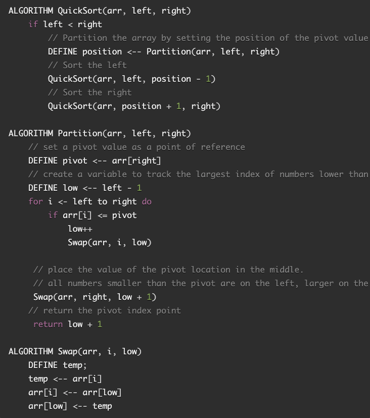

# Code Challenge: Quick Sort

- Pull Request [quick-sort](https://github.com/dcalhoun286/data-structures-and-algorithms/pull/46)
- [Blog](./assets/BLOG.md)

## Author

Dar-Ci Calhoun

## Challenge

Review the pseudocode below, then trace the algorithm by stepping through the process with the provided sample array. Document our explanation by creating a blog article that shows the step-by-step output after each iteration through some sort of visual.

Ensure that your code is working with unit tests.

## Approach & Efficiency

Follow the link to the [blog](assets/BLOG.md) to see a more in-depth explanation of the approach taken for this code challenge.

## Solution

- [Solution code for quick-sort](lib/quick-sort.js)

## Resouces and Collaborators

This article was a big help in my making much more sense of `quickSort` than the provided pseudocode:

- [Guru99.com](https://www.guru99.com/quicksort-in-javascript.html)
