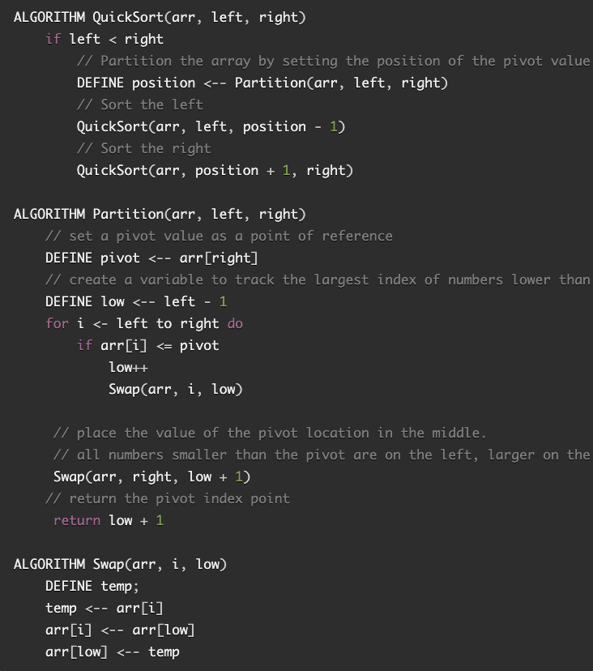

# Blog: Quick Sort

For this assignment, I wrote a blog that documents what the algorithm is doing step-by-step as provided by the pseudocode below:

In the above example, the arguments used when invoking this method is an array of integers `inputArray`, 0, and `inputArray.length - 1`.

Let's say you have the following array:

`[8, 4, 23, 42, 16, 15]`

## Approach & Efficiency

This approach has an efficiency of `O(n*log(n))`. While the ranges between the points of reference are halved as the recursive methods are called (hence the log(n)), the time it takes for this method to complete grows exponentially in proportion to the length of the array because of the nested loops.
