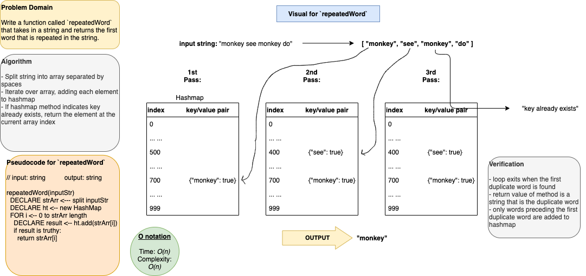

## repeatedWord

A code challenge that finds the first repeated word in a book.

## Author: Dar-Ci Calhoun

## Links

- Pull Request [repeated-word]()

## Challenge

Write a function that accepts a lengthy string parameter. Without utilizing any of the built-in library methods available to your language, return the first word to occur more than once in that provided string.

## Approach & Efficiency

## Solution

- [Solution code for repeated-word](./lib/repeated-word.js)
- 
