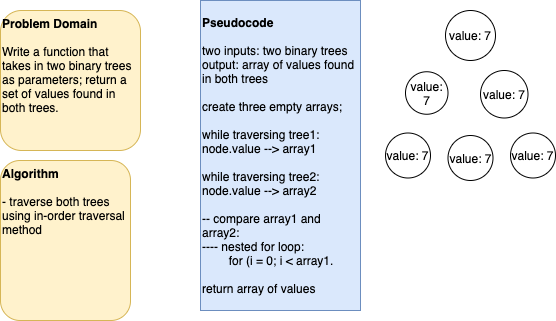

## treeIntersection

A code challenge that finds the first repeated word in a book.

## Author: Dar-Ci Calhoun

## Links

- Pull Request [tree-intersection](https://github.com/dcalhoun286/data-structures-and-algorithms/pull/49)

## Challenge

Write a function that accepts a lengthy string parameter. Without utilizing any of the built-in library methods available to your language, return the first word to occur more than once in that provided string.

## Approach & Efficiency

## Solution

- [Solution code for tree-intersection](./lib/tree-intersection.js)
- 

## Resources and Collaborators

- Taylor Thornton: code challenge partner
