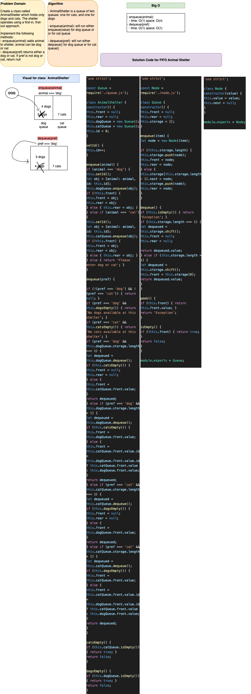

# FIFO Animal Shelter

This is a Data Structures and Algorithms challenge that works with [queues](https://codefellows.github.io/common-curriculum/data_structures_and_algorithms/Code_401/class-10/resources/stacks_and_queues.html). I created a class `ShelterQueue` that implements two `Queue` class objects.

# Author: Dar-Ci Calhoun

## Links

- Pull Request [fifo-animal-shelter](https://github.com/dcalhoun286/data-structures-and-algorithms/pull/38)

## Challenge

### Features

- Create a class called AnimalShelter which holds only dogs and cats. The shelter operates using a *first-in, first-out* approach.
- Implement the following methods:
  - `enqueue(animal)`: adds `animal` to the shelter. `animal` can be either a dog or a cat object.
  - `dequeue(pref)`: returns either a dog or a cat. If `pref` is not `dog` or `cat` then return null.

## Approach & Efficiency & API

Upon instantiation of my `AnimalShelter` class, two `Queue` classes are instantiated for the `catQueue` and `dogQueue` properties, along with a `front`, `rear`, and `id` property. The animal with the lowest `id` is stored in `front`, while the most recently enqueued animal is stored in `rear`. If both inner queues are empty, `front` and `rear` are set to `null`.

- `enqueue(animal)`: If `animal` is equal to `'dog'`, `enqueue(item)` is run on `dogQueue`. If `animal` is equal to `'cat'`, `enqueue(item)` is run on `catQueue`. Since the space requirement is dependent on the parameter being passed into `enqueue`, space complexity is `O(n)`. Time complexity is `O(1)`, as no traversal or iteration is required to add the item to the queue.

- `dequeue(pref)`: If `pref` is equal to `'dog'`, `dequeue()` is run on `dogQueue`. The same will be run on `catQueue` if `pref` is equal to `'cat'`. Both time and space complexity is `O(1)`, as no additional space is required to run this method, and it will require the same amount of time to remove an item from the queue regardless of how large the queue is.

- `catsEmpty()` and `dogsEmpty()`: I added these two methods to my `AnimalShelter` class to make my code easier to read than calling the methods from the inner queues. `catsEmpty()` runs `isEmpty()` on the cats queue, and `dogsEmpty()` runs `isEmpty()` on the dogs queue. The method returns `true` if `isEmpty()` returns `true`; otherwise, it returns `false`. Both time and space complexity for this method is `O(1)`, as `isEmpty()` is reading whether the `front` property of the indicated queue returns truthy or falsy.

## Solution

### Solution Code

- [ShelterQueue class](lib/fifo-animal-shelter.js)
- [Node class](lib/node.js)
- [Queue class](lib/queue.js)

### Whiteboards

