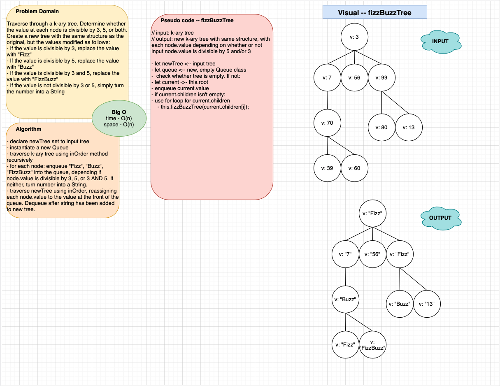

# K-ary Trees

This is a Data Structures and Algorithms challenge that works with [k-ary trees](https://codefellows.github.io/common_curriculum/data_structures_and_algorithms/Code_401/class-15/resources/Trees.html).

## Author: Dar-Ci Calhoun

## Links

- Pull Request [fizzbuzz-tree](https://github.com/dcalhoun286/data-structures-and-algorithms/pull/43)

## Challenge

### Features

- Write a function called `fizzBuzzTree` which takes a k-ary tree as an argument.
- Without utilizing any of the built-in methods available to your language, determine whether or not the value of each node is divisible by 3, 5 or both. Create a new tree with the same structure as the original, but the values modified as follows:
  - If the value is divisible by 3, replace the value with "Fizz"
  - If the value is divisible by 5, replace the value with "Buzz"
  - If the value is divisible by 3 an 5, replace the value with "FizzBuzz"
  - If the value is not divisible by 3 or 5, simply turn the number into a String.
- Return a **new** tree.

### Structure and Testing

1. Can successfully traverse a k-ary tree
1. Can successfully enqueue and dequeue from a queue
1. Can successfully reassign each `node.value` on the new k-ary tree that is created

## Approach & Efficiency

Time efficiency is `O(h)` and space efficiency is `O(n)`. Every node in the input array must be visited to store in the Queue. The Queue is used to maintain the order in which I need to reassign the value of each node in the output k-ary tree. I reassign these values by visiting every node in the output k-ary tree. I traverse both trees using the `inOrder` traversal method, which is recursive.

## API

- `class Node`: Each Node in the k-ary tree has two properties: a `value` and a `children`. A new Node is instantiated with a value as its parameter which is stored in the `value` property, while `children` is set to an empty array.
- `class Queue`: Each Queue has three properties: `front`, `rear`, and `storage`. Upon instantiation of a new Queue, `front` and `rear` are set to `null` and `storage` is an empty array. The `front` and `rear` properties hold the first and last Nodes in the Queue, and `storage` maintains the order in which the Nodes are enqueued/dequeued.
  - `enqueue(item)`: The method I used has a time/space efficiency of O(1). The value passed as a parameter in `enqueue` is used to instantiate a Node, and then this Node is added to the Queue. Nodes are added to `Queue.storage` by utilizing the `Array.prototype.push` method, which adds a value to the end of an array. Since a Queue operates on a **F**irst **I**n, **F**irst **O**out concept, `Queue.rear` is reassigned to the Node that was added to the Queue.
  - `dequeue()`: the method I used for this achieves an O(1) efficiency and does not use a parameter. A Node is removed from `Queue.storage` utilizing the `Array.prototype.shift` method, which removes from an array the value located at index 0. because of **FIFO**, `Queue.front` is reassigned to whatever Node is now at index 0. If the Node that was removed was the only item in the Queue, both `Queue.front` and `Queue.rear` are reassigned to `null`. If this method is called on an empty Queue, an `'Exception'` is raised.
  - `peek()`: This method reads the `front` property of a Queue and returns the value of the Node stored in `front`, which is the first Node in the Queue. If this method is called on an empty Queue, an `'Exception'` is raised.
  - `isEmpty()`: This method also reads the `front` property of a Queue and returns a boolean value. If `Queue.front` equals `null`, `isEmpty()` will return `true`, meaning the Stack is empty. If `Queue.front` has a Node stored there, `isEmpty()` will return `false`.
<!-- - `class KaryTree`: -->

## Solution

### Solution Code

- [Node class](lib/node.js)
- [Queue class](lib/queue.js)
- [K-ary tree class](lib/fizz-buzz-tree.js)

### Whiteboard

## Resources and Collaborators
