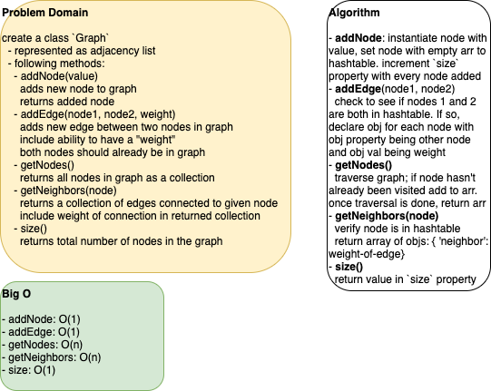

# graph

This is a code challenge that implements a graph, which is a data structure that represents a collection of vertices and edges.

## Author: Dar-Ci Calhoun

## Links

- Pull Request [graph]()

## Challenge

Implement your own Graph. The graph should be represented as an adjacency list, and should include the following methods:

- `addNode()`
  - Adds a new node to the graph
  - Takes in the value of that node
  - Returns the added node
- `addEdge()`
  - Adds a new edge between two nodes in the graph
  - Include the ability to have a "weight"
  - Takes in the two nodes to be connected by the edge
    - Both nodes should already be in the Graph
- `getNodes()`
  - Returns all of the nodes in the graph as a collection (set, list, or similar)
- `getNeighbors()`
  - Returns a collection fo edges connected to the given node
  - Takes in a given node
  - Include the weight of the connection in the returned collection
- `size()`
  - Returns the total number of nodes in the graph

### Structure and Testing

Write tests to prove the following functionality:

1. Node can be successfully added to the graph
1. An edge can be successfully added to the graph
1. A collection of all nodes can be properly retrieved from the graph
1. All appropriate neighbors can be retrieved from the graph
1. Neighbors are returned with the weight between nodes included
1. The proper size is returned, representing the number of nodes in the graph
1. A graph with only one node and edge can properly be returned
1. An empty graph properly returns null

## Approach & Efficiency, API

## Solution

### Solution Code

[class Graph](./lib/graph.js)

### Whiteboard

