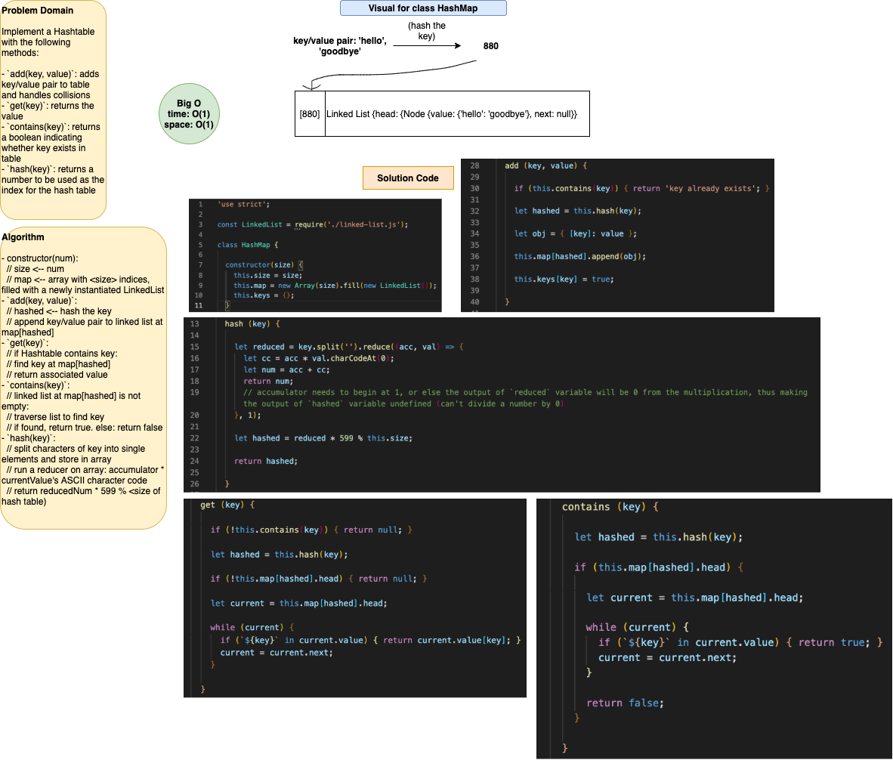

# hashTable

This is a code challenge that implements a hash table, which is a data structure used for storing key/value pairs. When adding a key/value pair to a hash table, an algorithm is run on the key to calculate the index of an array at which the key/value will be stored. For the purposes of this assignment, the data structure being used at all indices is a Linked List.

## Author: Dar-Ci Calhoun

## Links

- Pull Requests
  - [Pull 47 - hashtable](https://github.com/dcalhoun286/data-structures-and-algorithms/pull/47)
  - [Pull 54 - hashtable](https://github.com/dcalhoun286/data-structures-and-algorithms/pull/54)

## Challenge

Implement a Hash Table with the following methods:

1. `add`: takes in both the key and value. This method should hash the key, and add the key and value pair to the table, handling collisions as needed.
1. `get`: takes in the key and returns the value from the table.
1. `contains`: takes in the key and returns a boolean, indicating if the key exists in the table already.
1. `hash`: takes in an arbitrary key and returns an index in the collection.

### Structure and Testing

Write tests to prove the following functionality:

1. Adding a key/value to your hash table results in the value being in the data structure
2. Retrieving based on a key returns the value stored
3. Successfully returns null for a key that does not exist in the hash table
4. Successfully handle a collision within the hash table
5. Successfully retrieve a value from a bucket within the hash table that has a collision
6. Successfully hash a key to an in-range value

## Approach & Efficiency

- `add(key, value)` has a max time complexity of `O(1)` because we will be able to add the key/value pair by directly accessing the map index that was calculated by the hash (instead of iterating over the map). If there is a collision present at the calculated index, we need to traverse the Linked List to find the value associated with the input key. Max space complexity is `O(1)`: the key/value pair is being added to the hash map as an object `{[key]: value}` at the hashed index, and this key is also being added as a property to the hash table's `keys` object and set to `true`. If you attempt to add a key that already exists, the method will return a message `'key already exists'`.
- `get(key)` has a max time complexity of `O(1)` because we will be able to find the index where the key is located by directly accessing the map index that was calculated by the hash (instead of iterating over the map). We will then traverse the Linked List to locate the node containing an object with that key as its property, and then return the associated value. Max space complexity is `O(1)` as we are performing a search/retrieve by hashing the key to directly access the index of the map at which the key would be located. If the key does not exist in the hash table, the method will return `null`.
- `contains(key)` returns a boolean. It has a max space and time complexity of `O(1)` because we are attempting to locate the key in almost the exact same way we would run a `get` on that key, except for returning the value for that key if/once it is found, the method will return `true`. If the key is not found, the method will return `false`.
- `hash(key)`: this method returns a number by first running a reducer on the key based on the ASCII value of each character. The math run on the reduced number is as follows: `reduced * 599 % this.size` to ensure that the output of this method falls within the range of available indices in the hash table. This has a time and space complexity of `O(1)`.

## Solution

### Solution Code

- [class HashMap](lib/hashtable.js)

### Whiteboard

## Resources and Collaborators

- [Stack Overflow: how to check whether a key exists in a JavaScript object](https://stackoverflow.com/questions/1098040/checking-if-a-key-exists-in-a-javascript-object)
