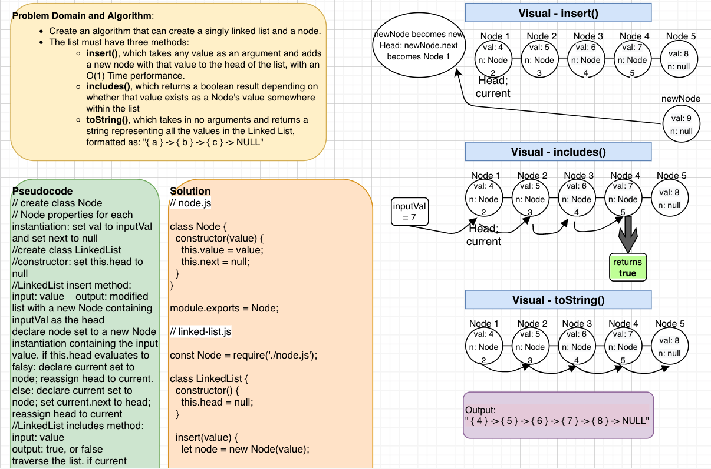
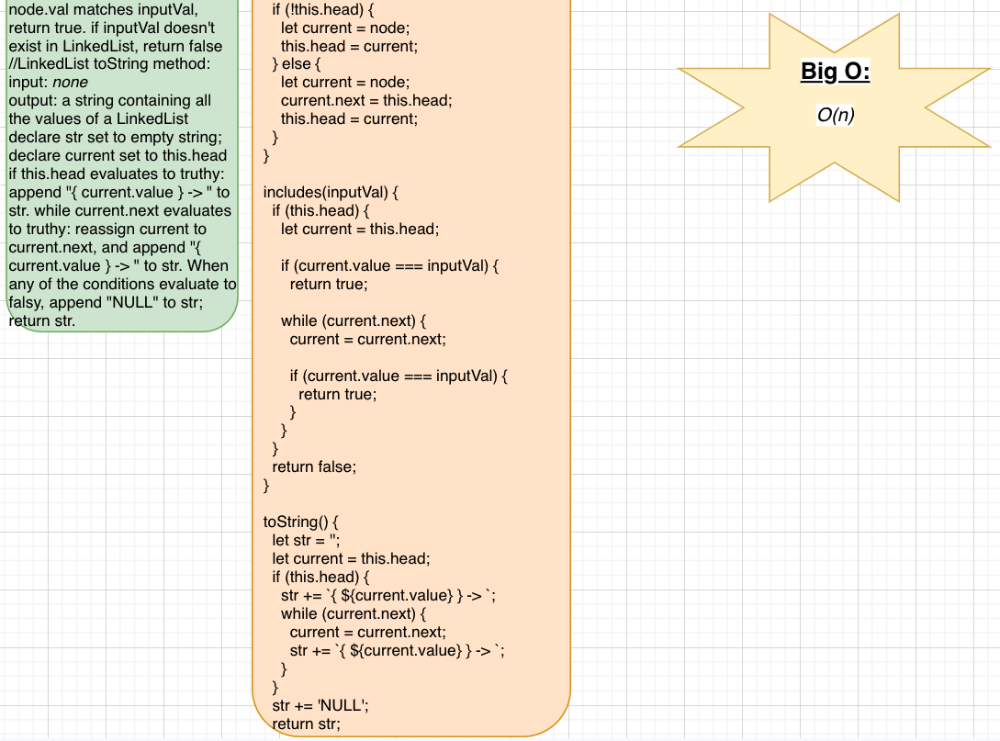

# Implementation: Singly Linked Lists

This is a Data Structures and Algorithms challenge that works with [singly linked lists](https://www.educative.io/edpresso/what-is-a-singly-linked-list).

- Pull Request [Linked List](https://github.com/dcalhoun286/data-structures-and-algorithms/pull/31)

## Author: Dar-Ci Calhoun

## Challenge - `linked-list` branch

### Features

- Create a Node class that has properties for the value stored in the Node, and a pointer to the next Node.
- Within your LinkedList class, include a head property. Upon instantiation, an empty Linked List should be created.
  - Define a method called `insert` which takes any value as an argument and adds a new node with that value to the `head` of the list with an O(1) Time performance.
  - Define a method called `includes` which takes any value as an argument and returns a boolean result depending on whether that value exists as a Node's value somewhere within the list.
  - Define a method called `toString` which takes in no arguments and returns a string representing all the values in the Linked List, formatted as:
    - `"{ a } -> { b } -> { c } -> NULL"`
- Any exceptions or errors that come from your code should be semantic, capturable errors. For example, rather than a default error thrown by your language, your code should raise/throw a custom, semantic error that describes what went wrong in calling the methods you wrote for this lab.
- Be sure to follow your language/frameworks standard naming conventions.

### Structure and Testing

Utilize the Single-responsibility principle: any methods you write should be clean, reusable, abstract component parts to the whole challenge.

Write tests to prove the following functionality:

1. Can successfully instantiate an empty linked list
1. Can properly insert into the linked list
1. The head property will properly point to the first node in the linked list
1. Can properly insert multiple nodes into the linked list
1. Will return true when finding a value within the linked list that exists
1. Will return false when searching for a value in the linked list that does not exist
1. Can properly return a collection of all the values that exist in the linked list

## Approach & Efficiency

An explanation for my approach:

- Each Node always has at least `value` property and a `next` property, with the default value of `next` being `null`. Since this is a singly linked list, those are the only two properties I need. I will instantiate this class to build my Linked List.
- I used the approach below for `insert(value)` because regardless of the size of the linked list, to achieve O(1), we only need to grow our linked list by finding the head of the list and attaching our new node to the head.
- I used the approach below for `includes(inputVal)` because if the head of the list evaluates to `false`, none of the code block needs to run, and the method can terminate by returning `false`. This method achieves O(n), since at most it might need to traverse the entire list to possibly find a match.
- `toString()` requires a big O of O(n) because we must visit every node in the list to read its value property and insert it into the output string.

## Challenge - `ll-insertions` branch

### Added Features

- Define a method called `append(value)` which adds a new node with the given `value` to the end of the list
- Define a method called `insertBefore(value, newVal)` which adds a new node with the given `newVal` immediately before the first `value` node
- Define a method called `insertAfter(value, newVal)` which adds a new node with the given `newVal` immediately after the first `value` node.

### Structure and Testing

Utilize the Single-responsibility principle: any methods you write should be clean, reusable, abstract component parts to the whole challenge.

Write tests to prove the following functionality:

1. Can successfully add a node to the end of the linked list
1. Can successfully add multiple nodes to the end of a linked list
1. Can successfully insert a node before a node located in the middle of a linked list
1. Can successfully insert a node before the first node of a linked list
1. Can successfully insert after a node in the middle of the linked list
1. Can successfully insert a node after the last node of the linked list

## Approach & Efficiency

An explanation for my approach:

- I used the approach below for `append(value)` because [...].
- I used the approach below for `insertBefore(value, newVal)` because [...].
- I used the approach below for `insertAfter(value, newVal)` because [...].

## Solution

**WHITEBOARD for `linked-list` branch -- TOP HALF**

**WHITEBOARD for `linked-list` branch -- BOTTOM HALF**

**WHITEBOARD for `ll-insertions` branch**

**Solution Code**:

- [Node Class](./lib/node.js)
- [LinkedList Class](./lib/linked-list.js)

## Collaborators

- Ron Dunphy (TA) helped me debug why my test suites were not running properly.
- I worked on the following methods with classmate Dawit Ayana:
  - `append(value)`
  - `insertBefore(value, newVal)`
  - `insertAfter(value, newVal)`
