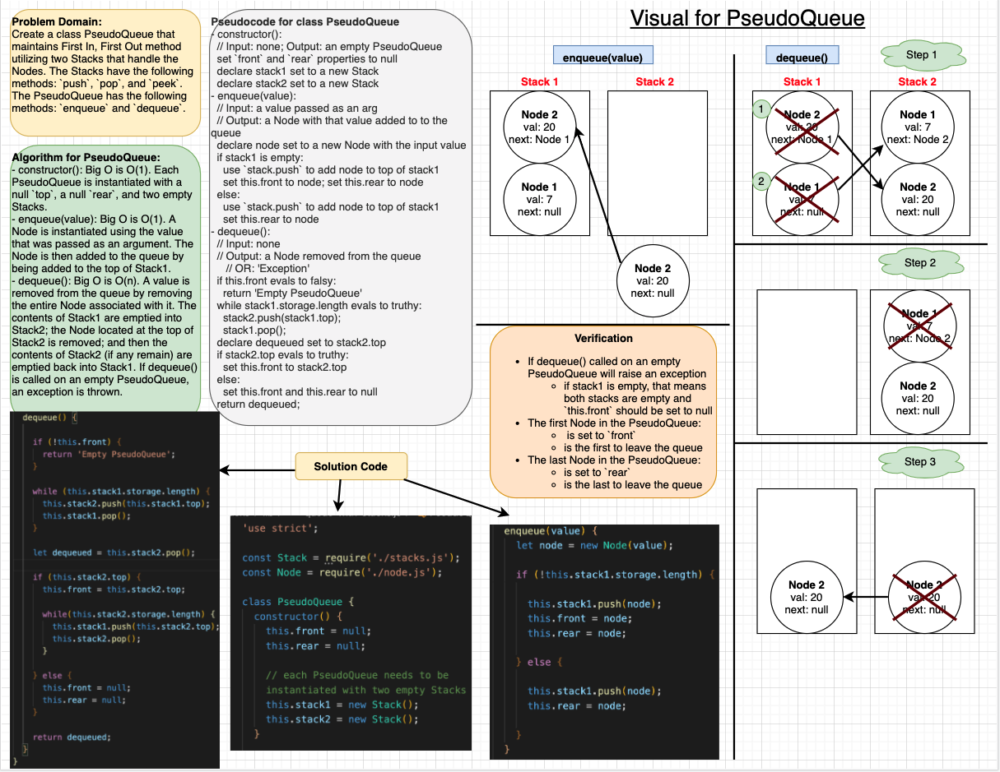

# Queue With Stacks

This is a Data Structures and Algorithms challenge that works with [stacks and queues](https://codefellows.github.io/common_curriculum/data_structures_and_algorithms/Code_401/class-10/resources/stacks_and_queues.html). In this challenge, instead of the First In, First Out (FIFO) method being implemented on Queues using an array, FIFO is implemented using two Stacks.

## Author: Dar-Ci Calhoun

## Links

- Pull Request [queue-with-stacks](https://github.com/dcalhoun286/data-structures-and-algorithms/pull/36)

## Challenge

### Features

- Create a brand new `PseudoQueue` class. Do not use an existing Queue. Instead, this `PseudoQueue` class will implement our standard queue interface (the two methods listed below), but will internally only utilize 2 `Stack` objects. Ensure that you create your class with the following methods:
  - `enqueue(value)` which inserts `value` into the PseudoQueue
  -`dequeue()` which extracts a value from the PseudoQueue
- The `Stack` instances have only `push`, `pop`, and `seek` methods. You should use your own Stack implementation. Instantiate these Stack objects into your PseudoQueue constructor.

### Structure and Testing

Write tests to prove the following functionality:

1. Can successfully instantiate an empty PseudoQueue
1. Can successfully enqueue a value into a PseudoQueue
1. Can successfully enqueue multiple values into a PseudoQueue
1. Can successfully dequeue a value from the PseudoQueue
1. Can successfully empty a PseudoQueue after calling multiple dequeues
1. Calling dequeue on an empty PseudoQueue raises an exception

## Approach & Efficiency

- `enqueue(item)` achieves O(1). Regardless of how many nodes are in the queue, it takes virtually the same amount of time to add another node, as this is done by performing the `push` method onto `stack1`, which itself is a method with O(1) efficiency.
- `dequeue(item)` achieves O(n). Since a Stack utilizes a **F**irst **I**n, **L**ast **O**ut approach, this is the opposite of a queue, which utilizes a **F**irst **I**n, **F**irst **O**ut approach. Since the order of nodes in a PseudoQueue is maintained by utilizing two Stacks and we only have direct access to the node at the top of a Stack, in order to remove the first node in a PseudoQueue, the contents of `stack1` must be emptied into `stack2` by iterating over the `stack1.storage` array to reverse the order of the nodes, giving us access to the node at the front of the PseudoQueue by now utilizing `stack2`. This node is then removed, and to preserve the original order of the PseudoQueue for when `dequeue` is called again, all nodes remaining in `stack2` must be emptied again into `stack1` by iterating over the `stack2.storage` array. Since in most cases a `while` loop performs more efficiently than a `for` loop, a `while` loop is used to iterate over the arrays.

## API

- `class PseudoQueue`: Each PseudoQueue has four properties: a `front`, a `rear`, a `stack1`, and a `stack2`. Upon instantiation of a new PseudoQueue, `front` and `rear` are set to `null`; and `stack1` and `stack1` are empty, newly instantiated Stacks. The `stack1` is used to maintain the order in which values are enqueued, and `stack2` is only utilized to dequeue items from the PseudoQueue.
  - `enqueue(item)`: The value passed as an argument in `enqueue` is used to instantiate a Node, and then this Node is added to the top of `stack1`.
  - `dequeue()`: The contents of `stack1` are emptied into `stack2` using a `while` loop. The node at the top of `stack2` is removed; then, another `while` loop is used to empty the remaining contents (if any) of `stack2` back into `stack1`. If `dequeue` is called on an empty PseudoQueue (if `PseudoQueue.front` is equal to `null`)

## Solution

### Solution Code

- [class PseudoQueue](lib/queue-with-stacks.js)

### Whiteboard

## Resources and Collaborators

- [YouTube: Implement a Queue Using Stacks](https://www.youtube.com/watch?v=Wg8IiY1LbII)
