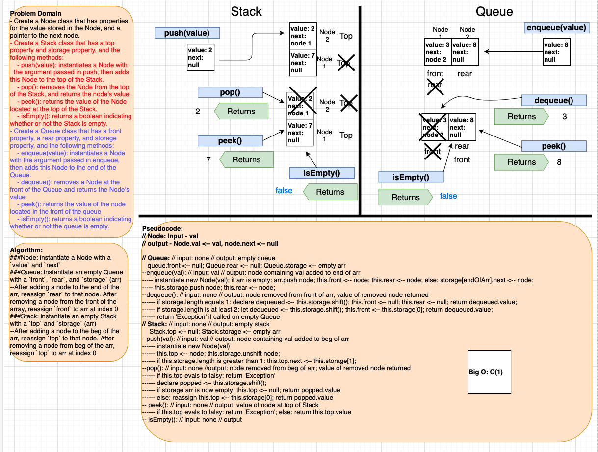
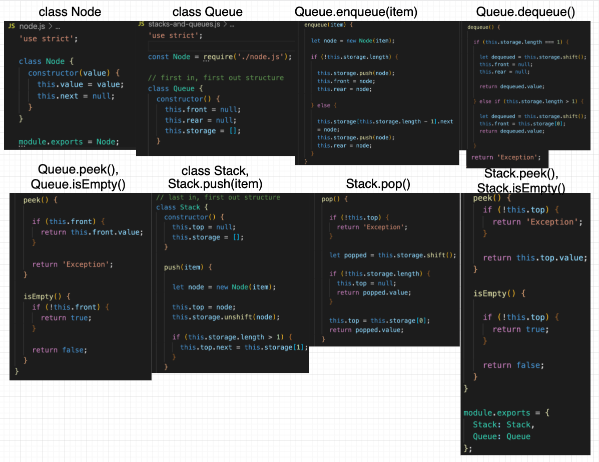

# Stacks and Queues

This is a Data Structures and Algorithms challenge that works with [stacks and queues](https://codefellows.github.io/common_curriculum/data_structures_and_algorithms/Code_401/class-10/resources/stacks_and_queues.html).

## Author: Dar-Ci Calhoun

## Links

- Pull Request [stacks-and-queues](https://github.com/dcalhoun286/data-structures-and-algorithms/pull/35)

<!-- Short summary or background information -->

## Challenge

### Features

- Create a `Node` class that has properties for the value stored in the Node, and a pointer to the next node.
- Create a `Stack` class that has a `top` property. It creates an empty STack when instantiated.
  - This object should be aware of a default empty value assigned to `top` when the stack is created.
  - Define a method called `push` which takes any value as an argument and adds a new node with that value to the `top` of the stack with an O(1) Time performance.
  - Define a method called `pop` that does not take any argument, removes the node from the top of the stack, and returns the node's value.
    - Should raise exception when called on empty stack
  - Define a method called `peek` that does not take an argument and returns the value of the node located on top of the stack, without removing it from the stack.
    - Should raise exception when called on empty stack
  - Define a method called `isEmpty` that takes no argument, and returns a boolean indicating whether or not the stack is empty.
- Create a `Queue` class that has a `front` property. It creates an empty Queue when instantiated.
  - This object should be aware of a default empty value assigned to `front` when the queue is created.
  - Define a method called `dequeue` that does not take any argument, removes the node from the front of the queue, and returns the node's value.
    - Should raise exception when called on empty queue
  - Define a method called `peek` that does not take an argument and returns the value of the node located in the front of the queue, without removing it from the queue.
    - Should raise exception when called on empty queue
  - Define a method called `isEmpty` that takes no argument, and returns a boolean indicating whether or not the queue is empty.
- Be sure to follow your language's best practices for naming conventions.

### Structure and Testing

Utilize the Single-responsibility principle: any methods you write should be clean, reusable, abstract component parts to the whole challenge. You will be given feedback and marked down if you attempt to define a large, complex algorithm in one function definition.

Write tests to prove the following functionality:

1. Can successfully push onto a stack
1. Can successfully push multiple values onto a stack
1. Can successfully pop off the stack
1. Can successfully empty a stack after multiple pops
1. Can successfully peek the next item on the stack
1. Calling pop or peek on empty stack raises exception
1. Can successfully enqueue multiple values into a queue
1. CAn successfully dequeue out of a queue the expected value
1. Can successfully peek into a queue, seeing the expected value
1. Can successfully empty a queue after multiple dequeues
1. Can successfully instantiate an empty queue
1. Calling dequeue or peek on empty queue raises exception

## Approach & Efficiency
<!-- What approach did you take? Why? What is the Big O space/time for this approach? -->

I achieved an efficiency of O(1) for all of my class instantiations and the methods called on them. This was made possible because to utilize the methods, What's occurring is a reading of what is stored in `<property>.value`, in the front of the array (index 0), the array at index 1, or the last index of the array. This means there is no traversing or iterating necessary, no matter how much data is stored in a Queue or Stack.

## API

- `class Node`: Each Node has two properties: a `value` and a `next`. A new Node is instantiated with a value as its parameter which is stored in the `value` property, while `next` is set to `null`.
- `class Queue`: Each Queue has three properties: `front`, `rear`, and `storage`. Upon instantiation of a new Queue, `front` and `rear` are set to `null` and `storage` is an empty array. The `front` and `rear` properties hold the first and last Nodes in the Queue, and `storage` maintains the order in which the Nodes are enqueued/dequeued.
  - `enqueue(item)`: The method I used has a time/space efficiency of O(1). The value passed as a parameter in `enqueue` is used to instantiate a Node, and then this Node is added to the Queue. Nodes are added to `Queue.storage` by utilizing the `Array.prototype.push` method, which adds a value to the end of an array. Since a Queue operates on a **F**irst **I**n, **F**irst **O**out concept, `Queue.rear` is reassigned to the Node that was added to the Queue.
  - `dequeue()`: the method I used for this achieves an O(1) efficiency and does not use a parameter. A Node is removed from `Queue.storage` utilizing the `Array.prototype.shift` method, which removes from an array the value located at index 0. because of **FIFO**, `Queue.front` is reassigned to whatever Node is now at index 0. If the Node that was removed was the only item in the Queue, both `Queue.front` and `Queue.rear` are reassigned to `null`. If this method is called on an empty Queue, an `'Exception'` is raised.
  - `peek()`: This method reads the `front` property of a Queue and returns the value of the Node stored in `front`, which is the first Node in the Queue. If this method is called on an empty Queue, an `'Exception'` is raised.
  - `isEmpty()`: This method also reads the `front` property of a Queue and returns a boolean value. If `Queue.front` equals `null`, `isEmpty()` will return `true`, meaning the Stack is empty. If `Queue.front` has a Node stored there, `isEmpty()` will return `false`.
- `class Stack`: A Stack has two properties: `top` and `storage`. Upon instantiation of a new Stack, `top` is equal to `null`, and `storage` is an empty array. Because a Stack operates on **F**irst **I**n, **L**ast **O**ut, the first Node added to a Stack always has a next equal to `null`.
  - `push(item)`: The value passed as a parameter for `push` is used to instantiate a new Node, which is added to `Queue.storage` using `Array.prototype.unshift`. Every subsequent Node added to the Stack becomes the new `top` value, and this Node's `next` is reassigned to whatever Node was added immediately preceding it.
  - `pop()`: When this method is called on a Stack, the Node at the top of the Stack is removed using the `Array.prototype.shift` method. The `top` is reassigned by reading whatever Node is now located at `Queue.storage[0]`. If the Node removed from the Stack was the only Node in the Stack, `Queue.top` is reassigned to `null`. If this method is called on an empty Stack, an `'Exception'` is raised.
  - `peek()`: This method reads the `top` property of a Class and returns the value of the Node stored there, as the Node stored in `top` is the Node at the top fo the Stack. If this method is called on an empty Stack, an `'Exception'` is raised.

## Solution

### Solution Code

- [Stack and Queue classes](lib/stacks-and-queues.js)
- [Node class](lib/node.js)

### Whiteboards

<!-- Embedded whiteboard image -->

