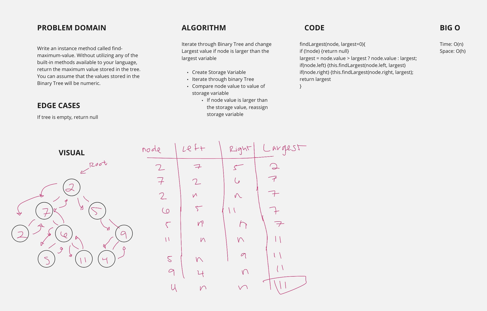

# Binary Tree and BST Implementation

This is a Data Structures and Algorithms challenge that works with [binary trees](https://codefellows.github.io/common_curriculum/data_structures_and_algorithms/Code_401/class-15/resources/Trees.html)

## Author: Dar-Ci Calhoun

## Links

- Pull Request [find-maximum-binary-tree](https://github.com/dcalhoun286/data-structures-and-algorithms/pull/41)

## Challenge

### Features

### Structure and Testing

## Approach & Efficiency

## API

## Solution

### Solution Code

- [Node](lib/node.js)
- [BinaryTree](lib/binary-tree.js)

### Whiteboards

## Resources and Collaborators

I worked on this challenge with Jenner Dulce, Taylor Thornton, and Clement Buchanan.
